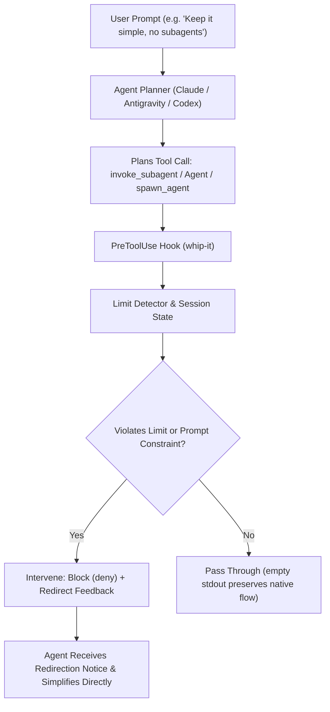

# whip-it!

> *"When a problem comes along, you must whip it! When something's going wrong, you must whip it!"*

Agent-planning guardrail and simplification lifecycle hook for **Anthropic (Claude Code)**, **Google (Antigravity CLI)**, and **OpenAI (Codex CLI)**.

`whip-it` acts as a deterministic circuit breaker outside the model's subjective loop. It intercepts autonomous agent tool calls when agents plan or spawn subagents, enforces prompt constraints and quota limits, and redirects them to simplify execution rather than autonomously overriding user limits.

---

## The Problem

Modern autonomous coding assistants frequently decide that complex tasks require decomposing into subagent swarms, recursive background workers, or parallel task delegates.

Even when the user explicitly instructs the agent:
- *"Keep it simple"*
- *"Do not spawn subagents"*
- *"Solve this directly in this thread without delegation"*
- *"Limit to at most 1 subagent"*
- *"Adhere to budget and execution limits"*

...the agent's internal planner often **autonomously overrides** these limits, spawning multi-agent hierarchies anyway. System prompt instructions alone cannot guarantee compliance because the model can self-rationalize or hallucinate exceptions.

`whip-it` provides external, deterministic enforcement at the tool-call lifecycle layer.



---

## Client Hook Matrix

`whip-it` supports native lifecycle hook specifications across all three major agent platforms:

| Agent Client | Intercepted Event | Target Tools | Hook Action on Limit Violation | Prompt Constraint Event |
| :--- | :--- | :--- | :--- | :--- |
| **Google Antigravity CLI** | `PreToolUse` | `invoke_subagent`, `define_subagent` | `{"decision": "deny", "reason": "..."}` | `PreInvocation` & prompt scanning |
| **Anthropic Claude Code** | `PreToolUse` | `Agent`, `Task` | `{"hookSpecificOutput": {"permissionDecision": "deny", ...}}` | `UserPromptSubmit` |
| **OpenAI Codex CLI** | `PreToolUse` | `spawn_agent`, `subagent`, `agent` | `{"hookSpecificOutput": {"permissionDecision": "deny", ...}}` | `UserPromptSubmit` |

---

## Behavior & Principles

- **Zero Runtime Dependencies**: The runtime engine uses only the Python 3.10+ standard library. Hook execution takes less than 15 ms, adding negligible latency to tool execution.
- **Autonomous Override Protection**: When a prompt explicitly specifies limits (e.g. *"no subagents"*), any subagent tool call is flagged as an autonomous override attempt and denied with high-priority simplification feedback.
- **Constructive Redirection**: Rejections provide clear, actionable instructions telling the agent exactly how to proceed: decompose linearly, use direct tools, and avoid delegation.
- **Preserves Native Permissions**: When a tool invocation is allowed, `whip-it` outputs nothing to stdout, allowing the host client's normal permission dialog and execution pipeline to proceed without interference.
- **Process Watchdog**: Built-in 5-second timeout watchdog guarantees that a stalled hook or malformed input will never deadlock the agent execution loop.
- **Atomic Session State**: Turn quotas and blocked override metrics are persisted in crash-safe atomic JSON files under `~/.local/state/whip-it` (or `WHIP_IT_STATE_DIR`).

---

## Installation

### From Source Checkout
```bash
git clone git@github.com:awill1988/whip-it.git ~/.local/share/whip-it
cd ~/.local/share/whip-it
poetry install
```

### Install Wheel
```bash
poetry build
pip install dist/*.whl
```

The installed `whip-it` executable will be placed on your `PATH`. Alternatively, you can use the checkout launcher `scripts/whip_it.py` without installing the wheel.

---

## Hook Configuration

### 1. Google Antigravity CLI
Merge the handlers from [`hooks/antigravity.json`](hooks/antigravity.json) into `~/.gemini/config/hooks.json` (global) or `.agents/hooks.json` (workspace):

```json
{
  "whip-it": {
    "PreToolUse": [
      {
        "matcher": "invoke_subagent|define_subagent",
        "hooks": [
          {
            "type": "command",
            "command": "whip-it --client antigravity --event PreToolUse"
          }
        ]
      }
    ],
    "PreInvocation": [
      {
        "type": "command",
        "command": "whip-it --client antigravity --event PreInvocation"
      }
    ],
    "PostToolUse": [
      {
        "matcher": "invoke_subagent",
        "hooks": [
          {
            "type": "command",
            "command": "whip-it --client antigravity --event PostToolUse"
          }
        ]
      }
    ]
  }
}
```

### 2. Anthropic Claude Code
Merge the handlers from [`hooks/claude.json`](hooks/claude.json) into `~/.claude/settings.json`:

```json
{
  "hooks": {
    "PreToolUse": [
      {
        "matcher": "Agent|Task",
        "hooks": [
          {
            "type": "command",
            "command": "whip-it --client claude --event PreToolUse"
          }
        ]
      }
    ],
    "UserPromptSubmit": [
      {
        "matcher": "",
        "hooks": [
          {
            "type": "command",
            "command": "whip-it --client claude --event UserPromptSubmit"
          }
        ]
      }
    ],
    "PostToolUse": [
      {
        "matcher": "Agent|Task",
        "hooks": [
          {
            "type": "command",
            "command": "whip-it --client claude --event PostToolUse"
          }
        ]
      }
    ]
  }
}
```

### 3. OpenAI Codex CLI
Merge the handlers from [`hooks/codex.json`](hooks/codex.json) into `~/.codex/hooks.json`:

```json
{
  "hooks": {
    "PreToolUse": [
      {
        "matcher": "spawn_agent|subagent|agent",
        "hooks": [
          {
            "type": "command",
            "command": "whip-it --client codex --event PreToolUse"
          }
        ]
      }
    ],
    "UserPromptSubmit": [
      {
        "matcher": "",
        "hooks": [
          {
            "type": "command",
            "command": "whip-it --client codex --event UserPromptSubmit"
          }
        ]
      }
    ]
  }
}
```

---

## CLI Utilities & Diagnostics

### Test Prompt Constraint Detection
Quickly inspect how `whip-it` evaluates a given user prompt:
```bash
whip-it test-prompt "Refactor auth, but keep it simple and no subagents"
```
Output:
```json
{
  "prompt": "Refactor auth, but keep it simple and no subagents",
  "subagents_allowed": false,
  "max_subagents": 0,
  "force_simplify": true,
  "detected_phrase": "no subagents"
}
```

### Inspect Status & Metrics
```bash
whip-it status
whip-it status --session my-conversation-id
```

### Inspect Configuration
```bash
whip-it config
```

### Reset Session State
```bash
whip-it reset my-conversation-id
```

---

## Configuration & Environment

`whip-it` looks for configuration in the following order of precedence:
1. `--config /path/to/config.json`
2. `.whip-it.json` in current working directory
3. `WHIP_IT_CONFIG` environment variable
4. `~/.config/whip-it/config.json` (or `%LOCALAPPDATA%/whip-it/config/config.json` on Windows)
5. Built-in defaults

### Options
```json
{
  "mode": "enforce",
  "default_max_subagents": 0,
  "auto_clamp": false,
  "strict_prompt_override": true,
  "timeout_seconds": 5,
  "tool_mappings": {
    "antigravity": ["invoke_subagent", "define_subagent"],
    "claude": ["Agent", "Task"],
    "codex": ["spawn_agent", "subagent", "agent"]
  }
}
```

### Environment Variables
- `WHIP_IT_MODE`: `enforce` | `advisory` | `off`
- `WHIP_IT_MAX_SUBAGENTS`: Default subagent quota (e.g. `0`, `1`, `2`)
- `WHIP_IT_AUTO_CLAMP`: `1` / `true` to clamp excessive arrays instead of hard denying
- `WHIP_IT_STATE_DIR`: Custom session state storage directory
- `WHIP_IT_CONFIG_DIR`: Custom configuration directory

---

## Development & Verification

Run tests:
```bash
poetry run python -m unittest discover -s tests -p "test_*.py" -v
```

Run linter:
```bash
poetry run ruff check .
poetry run ruff format --check .
```

Verify build:
```bash
poetry build
```

---

## License

MIT License. Copyright (c) 2026 Adam Williams.
