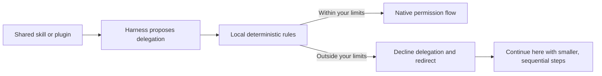

# whip-it!

> *“When a problem comes along, you must whip it!”*

**Share the skill. Try the plugin. Keep enough budget for the rest of your work.**

`whip-it` is a local agent guardrail for Claude Code, Codex, and Antigravity.
It puts your delegation limits outside the agent's discretion. When a plan gets
carried away, it redirects the agent to keep working here, in smaller steps.
One native executable; no additional language runtime, model download, or hosted
service required.

## Why whip it?

Someone shares a useful skill. You try a promising plugin. Your agent turns it
into a subagent expedition, and suddenly the experiment costs more than you
expected. Sharing good workflows should make trying things easier, without
surprise token storms eating the rest of your usage window.

Useful delegation belongs in the toolkit. You choose how much room it gets.
The research behind [ADR 0002](docs/adr/0002-deterministic-guardrails-and-constructive-redirection.md)
and [ADR 0003](docs/adr/0003-aggregate-trajectory-token-prediction-and-admission-control.md)
includes *Towards a Science of Scaling Agent Systems*, which finds that
“tool-heavy tasks suffer disproportionately from multi-agent overhead” under
fixed computational budgets. It also finds benefits on parallelizable tasks:
the work determines whether coordination earns its cost.
([Paper](https://arxiv.org/abs/2512.08296))

The aim is **usage continuity**: spread your available usage across the work you
want to finish, whether you're exploring on a personal subscription or managing
a team's budget. Today, `whip-it` enforces delegation limits and recognized prompt
constraints. Usage estimates are informational; it does not yet enforce a spending
cap or guarantee that your subscription lasts a week.

## Installation

Install directly from GitHub with Cargo and a current stable Rust toolchain (Rust 1.89 or
newer). Native builds are checked on macOS, Linux, and Windows, on x64 and ARM64.
Building requires your platform's linker: Xcode Command Line Tools on macOS,
a C toolchain on Linux, or Visual Studio C++ Build Tools for Windows MSVC.

```sh
cargo install --git https://github.com/awill1988/whip-it.git --locked --no-default-features
whip-it --version
```

Cargo installs `whip-it` in `~/.cargo/bin` on macOS/Linux, or
`%USERPROFILE%\.cargo\bin` on Windows, unless `CARGO_HOME` or an installation
root overrides it. Make that directory available on the agent client's `PATH`.
The installed executable does not require Rust or Python to run.

Published release downloads and a self-contained marketplace installation are
not available yet. For the Python reference implementation, see
[Python installation](docs/usage.md#python-installation).

## Hook setup

Merge the handlers from the matching file into your client's hook settings.
Preserve existing handlers; installing the executable alone does not enable hooks.

| Client | Hook configuration |
| --- | --- |
| Claude Code | [`hooks/claude.json`](hooks/claude.json) |
| Antigravity | [`hooks/antigravity.json`](hooks/antigravity.json) |
| Codex | [`hooks/codex.json`](hooks/codex.json) |

The files describe the payloads supported by the adapters. Hook registration
depends on the client version; use its supported settings mechanism.
Commands expect `whip-it` on `PATH`; otherwise use its absolute path with
the quoting required by the client's command runner.

The default delegation quota is **zero**. Configure
`default_max_subagents` or `WHIP_IT_MAX_SUBAGENTS` to permit delegation;
explicit prompt constraints take precedence.

Inspect configuration and prompt detection:

```sh
whip-it config
whip-it test-prompt "keep it simple, no subagents"
whip-it status
```

Try the [synthetic allow/deny examples](examples/README.md).
See the [usage guide](docs/usage.md) for configuration, state, and diagnostics.
Plan and usage assessment depend on available metadata; see
[decision tracing](docs/decision-tracing.md) for coverage and limitations.

## Keep working, slow your roll



A restricted delegation gets a reason and a way forward. The hook tells the
agent to use direct tools in the current session; the task can continue without
spawning more agents. This changes the requested approach, not the provider's
token rate, and the agent still has to follow the redirection.

Illustrative feedback for an exhausted delegation quota:

```text
whip-it | delegation paused | continue here
check: deterministic rule | no model call
source: configured quota
limit: 2 | reserved: 2 | requested: 1
next: keep working here in smaller, sequential steps; use direct tools
```

Claude receives this summary through `systemMessage`; the supported adapters
include it in denial reasons. Placement and error colors belong to the host
client. Allowed calls stay silent and preserve its normal permission flow.

### Is there a model involved?

| Mechanism | What it does today |
| --- | --- |
| Deterministic delegation rules | Enforce recognized prompt constraints and configured quotas. The same policy inputs produce the same decision. No model call. |
| Usage heuristics | Assess available numeric usage metadata. These estimates do not currently block calls; missing or stale data is not a safety guarantee. |
| Experimental offline softmax classifier | Produces an uncalibrated score through `classify`. It does not make hook admission decisions. |

The normal hook does not ask another language model whether your agent behaved.
Internal errors fail open to preserve availability, so this is a workflow
guardrail, not a billing firewall.

## Privacy and performance

The normal executable contains no telemetry collection or export code and makes
no network requests. Decisions run locally. It stores local quota state and
numeric usage snapshots; it may read local client usage metadata, but does not
persist prompts, tool arguments, or transcript contents. Installation downloads
and the host coding assistant have their own network behavior. Developer tracing
requires a separate diagnostic build or the Python reference.

The full hook process targets **under 15 ms**. This is a target, not a universal
deadline: see [reproducible benchmarks](benchmarks/README.md) for measured
percentiles, workload coverage, and platform results.

## Development

Use the Rust toolchain above, Python 3.10+, and Poetry with dependency-group
support (2.2+). Python supplies the reference implementation and verification tools.

```sh
poetry install
git config core.hooksPath .githooks
cargo run -- config
cargo run --release -- config
```

Run checks from the repository root:

```sh
cargo fmt --check
cargo clippy --locked --all-targets -- -D warnings
cargo test --locked
poetry check --lock --strict
poetry run ruff check .
poetry run ruff format --check .
poetry run python -m unittest discover -s tests
```

[Development verification](docs/usage.md#development-verification) covers
review-tool tests, native/reference parity, packaging, and profiling.
Architecture decisions are recorded in [`docs/adr/`](docs/adr/).

## Contributing

Found a rough edge? Have a smaller, clearer way to do it? Contributions are welcome.

Open an issue and wait for `status: accepted` or explicit maintainer acceptance
before implementing a contribution. The maintainer, `@awill1988`, is exempt
from this issue-first gate. Use lowercase Conventional Commits and include
verification results with your pull request.

See [CONTRIBUTING.md](CONTRIBUTING.md) for design constraints, commit rules,
and the seven-calendar-day triage and initial-review commitments.

## License

[MIT](LICENSE). Copyright © 2026 Adam Williams.
